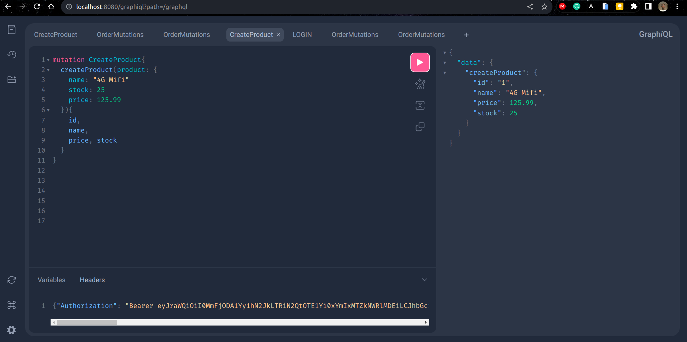

## GETTING STARTED

This project was built with the spring boot 3.0 and
make use of the following spring dependencies:
 - Spring for GraphQL
 - Spring Security and Oauth2 Resource Server for authentication and authorization
 - H2 Database for data storage


## There are two ways to set up and run this project
- Build and run with docker 
- Build and run with maven and java


## How to build and run with docker 
To build with docker all you need is  docker installed on your computer
Once you have installed Docker, you can `cd` into the  project  root directory and run the command
`docker build -t [IMAGE_NAME] .` where `IMAGE_NAME` is the name you want to give to your the Docker image that will be created

Once docker is done creating the image you can run
```docker run --name [CONTAINER_NAME] -p 8080:8080 -d IMAGE_NAME``` to start the application on port 8080.
`CONTAINER_NAME` is the name of the container that will be created

## How to build run  with maven and java
To run the application using this method, you need to have `maven` and `Java version 17` or later installed.
Once you've installed maven and the required version of java,
`cd` into the project root directory run
`mvn clean package` to build the project.
Once maven is done building the project run
`java -jar ./target/orderservice-0.0.1-SNAPSHOT.jar`. This will start the application on port `8080`


## Running queries and mutations
You can access the API using the included `GraphiQL` that ships with Spring for GraphQL or `PostMan`
which can accessed at `/grapgiql` which will be http://localhost:8080/graphiql

The application uses JWT authentication so to access protected resources you need to sign in to get a token
then add the token as an `Authorization` header on the request
 ## Sample Request
### Create User Account
```
mutation OrderMutations {
  createUser(user: {
    name: " papa"
    email:"papa@mail.com"
    password: "123"
    role: ADMIN
  }){
    id, name, email, role
  }
}
```

### Login
```
mutation{
  login(loginInput:{
    email: "papa@mail.com"
    password: "123"
  }){
    token
  }
}
```
### Create Product
```
mutation CreateProduct{
  createProduct(product: {
    name: "4G Mifi"
    stock: 25
    price: 125.99  
  }){
  	id,
    name,
    price, stock
  }
}
```
### A sample Image  Showing How to create a product with a using a jwt token for authentication using the included `GraphiQl`



## AUTHORIZATION  RULES
### The following actions require that you are authenticated with ADMIN role
- delete a user
- get all users
- get a user by id
- create a product ,update product, delete a product
### creating a user and logging in has no authorization

### All other actions require that  you're authenticated
